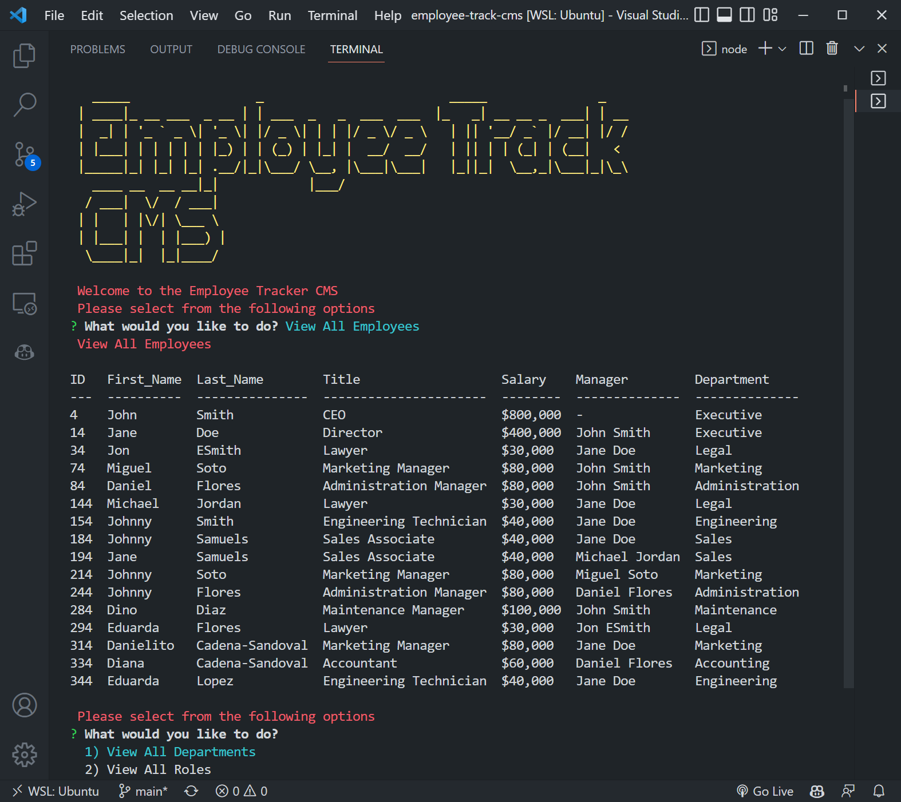
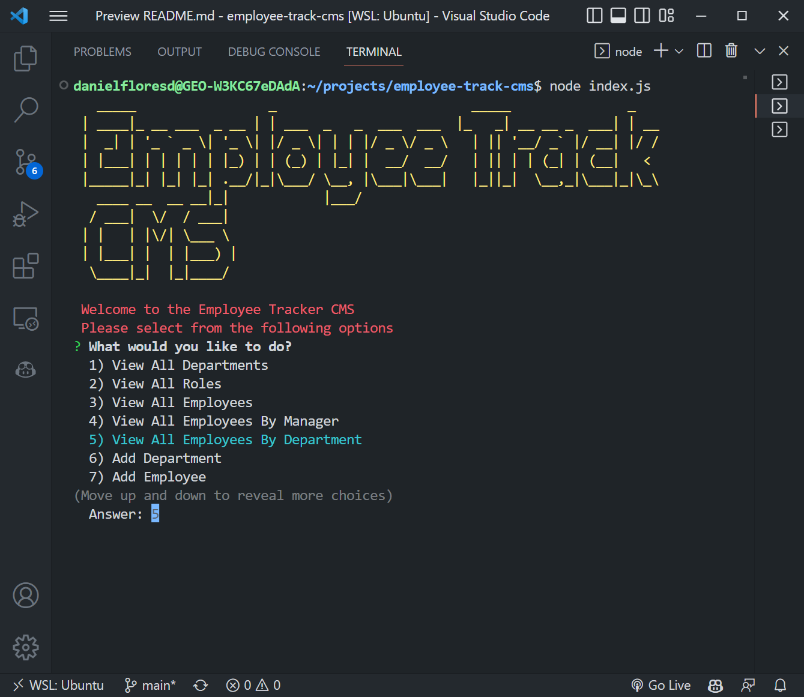
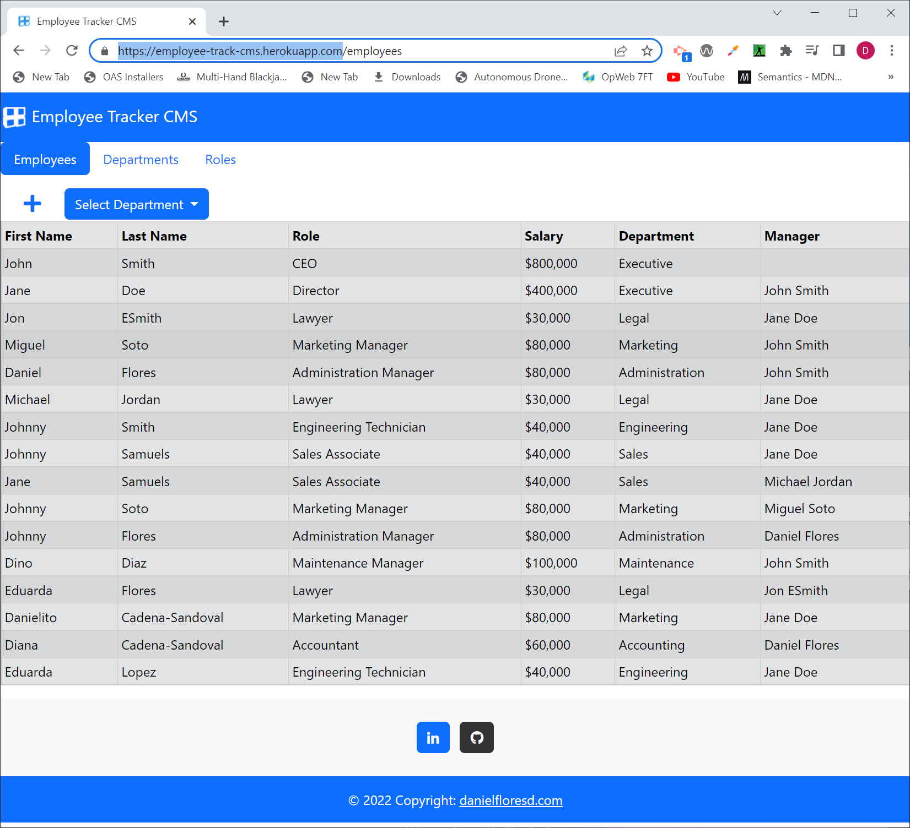

# Employee Track CMS

## Description

This CLI is a powerful tool for businesses looking to streamline the way they manage their organization. It helps them effectively assign departments, roles and salaries; add new employees; and create individualized salary roles. With this easy-to-use CLI, all company data and activities can be organized, managed, and tracked conveniently in one central database. There also a simple web interface that can be used to access the tool online.

<strong>🎥Click on video to view🎥</strong>

<a href="https://drive.google.com/file/d/1qTWG7uddcVcrCi7xVT3yNl4vStEt5ZMf/view?usp=share_link" target="_blank">
</img>
</a>

Download Video in <a href="./public/images/video.webm">webm</a> or <a href="./public/images/video.mp4">mp4</a>

## Table of contents

- [Description](#description)
- [Installation](#🛠️installation)
- [Usage](#💻usage)
- [Dependencies](#🧩dependencies)
- [License](#📛license)
- [Contributing](#🤝contributing)
- [Tests](#📃tests)
- [Questions](#❓questions)
- [Website](#🌐website)
- [Programming Languages](#👨‍💻programming-languages)
- [Credits](#👨creadits)

## 🛠️Installation

To install the application clone the repository https://github.com/danielfloresd/employee-track-cms and run node package manager with the following command: <strong>npm i</strong>    

## 💻Usage

After installing all dependencies run <strong>node index.js</strong> to start the CLI application. Additionally, you can run <strong>npm start</strong> to launch a webserver to access the interface thru the web browser.

## 🧩Dependencies

- inquirer
- mysql
- bootstrap

## 📛License

Project license: [MIT](https://choosealicense.com/licenses/mit).

<b>View License</b>
MIT License

Copyright (c) 2022 Daniel Flores D

Permission is hereby granted, free of charge, to any person obtaining a copy
of this software and associated documentation files (the "Software"), to deal
in the Software without restriction, including without limitation the rights
to use, copy, modify, merge, publish, distribute, sublicense, and/or sell
copies of the Software, and to permit persons to whom the Software is
furnished to do so, subject to the following conditions:

The above copyright notice and this permission notice shall be included in all
copies or substantial portions of the Software.

THE SOFTWARE IS PROVIDED "AS IS", WITHOUT WARRANTY OF ANY KIND, EXPRESS OR
IMPLIED, INCLUDING BUT NOT LIMITED TO THE WARRANTIES OF MERCHANTABILITY,
FITNESS FOR A PARTICULAR PURPOSE AND NONINFRINGEMENT. IN NO EVENT SHALL THE
AUTHORS OR COPYRIGHT HOLDERS BE LIABLE FOR ANY CLAIM, DAMAGES OR OTHER
LIABILITY, WHETHER IN AN ACTION OF CONTRACT, TORT OR OTHERWISE, ARISING FROM,
OUT OF OR IN CONNECTION WITH THE SOFTWARE OR THE USE OR OTHER DEALINGS IN THE
SOFTWARE.

    
       
## 🤝Contributing

If you would like to contribute, please follow the [GitHub contribution guidelines](https://github.com/github/docs/blob/main/CONTRIBUTING.md)

## 📃Tests

Testing implemented using jest. To run unit testing <strong>npm test</strong>

## ❓Questions

For questions, please contact:

- 
-   

## 🌐Website

To use the web app, please visit the [Employee Track CMS](https://employee-track-cms.herokuapp.com/)
</img>

## 👨‍💻Programming Languages

This project was created with: JavaScript, SQL, HTML

## 👨Credits

logger.js used to print colorful messages to console log was borrowed from the University of Arizona bootcamp course material

<!-- <b>User Story</b>
AS A manager
I WANT to generate a webpage that displays my team's basic info
SO THAT I have quick access to their emails and GitHub profiles

<b>Acceptance Criteria</b>
GIVEN a command-line application that accepts user input
WHEN I am prompted for my team members and their information
THEN an HTML file is generated that displays a nicely formatted team roster based on user input
WHEN I click on an email address in the HTML
THEN my default email program opens and populates the TO field of the email with the address
WHEN I click on the GitHub username
THEN that GitHub profile opens in a new tab
WHEN I start the application
THEN I am prompted to enter the team manager’s name, employee ID, email address, and office number
WHEN I enter the team manager’s name, employee ID, email address, and office number
THEN I am presented with a menu with the option to add an engineer or an intern or to finish building my team
WHEN I select the engineer option
THEN I am prompted to enter the engineer’s name, ID, email, and GitHub username, and I am taken back to the menu
WHEN I select the intern option
THEN I am prompted to enter the intern’s name, ID, email, and school, and I am taken back to the menu
WHEN I decide to finish building my team
THEN I exit the application, and the HTML is generated

    -->

<!-- User Story
AS A business owner
I WANT to be able to view and manage the departments, roles, and employees in my company
SO THAT I can organize and plan my business
Acceptance Criteria
GIVEN a command-line application that accepts user input
WHEN I start the application
THEN I am presented with the following options: view all departments, view all roles, view all employees, add a department, add a role, add an employee, and update an employee role
WHEN I choose to view all departments
THEN I am presented with a formatted table showing department names and department ids
WHEN I choose to view all roles
THEN I am presented with the job title, role id, the department that role belongs to, and the salary for that role
WHEN I choose to view all employees
THEN I am presented with a formatted table showing employee data, including employee ids, first names, last names, job titles, departments, salaries, and managers that the employees report to
WHEN I choose to add a department
THEN I am prompted to enter the name of the department and that department is added to the database
WHEN I choose to add a role
THEN I am prompted to enter the name, salary, and department for the role and that role is added to the database
WHEN I choose to add an employee
THEN I am prompted to enter the employee’s first name, last name, role, and manager, and that employee is added to the database
WHEN I choose to update an employee role
THEN I am prompted to select an employee to update and their new role and this information is updated in the database -->
